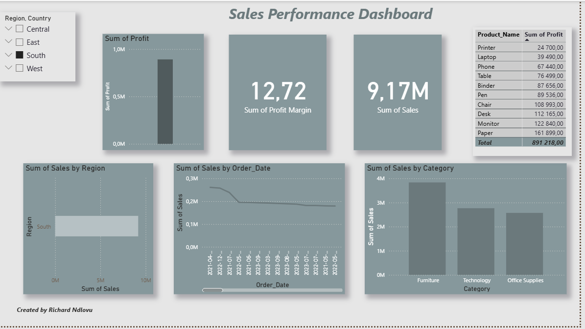

# Sales-Performance-Dashboard
This interactive dashboard analyzes company sales data to track revenue, profit, and performance trends by region, category, and product.  

## 📊 Dashboard Preview

## 📈 Dashboard Features
- Sales & Profit by Region
- Monthly Sales Trends
- Top Products by Profit Margin
- Interactive Filters (Region, Category)

**Tools & Stack:** SQL querying, Power BI dashboard design, and data modelling
